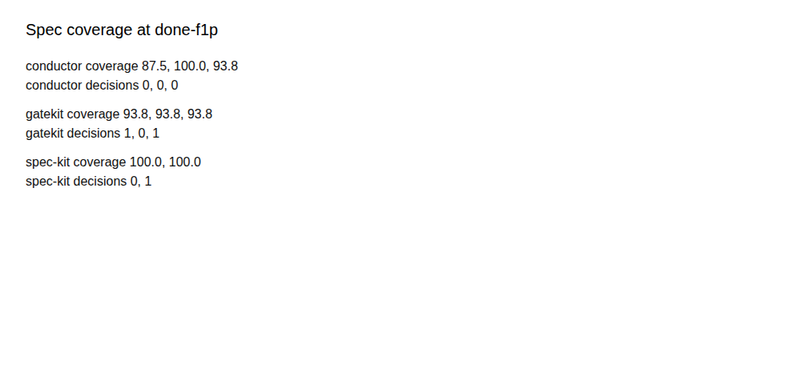

# The experiment behind the three-way comparison

This folder is the experiment behind the three-way comparison of spec-driven development — writing down what the software should do before an AI agent writes the code, and keeping that document as the thing the code is checked against — on Shelfmark, the app under test. The method is the artifact: a stranger who clones this repository holds the identical feature briefs, the pre-declared answers file, the seat prompts that install each framework from a pinned upstream commit, the trial runner that rebuilds every tagged commit in the fixture's own Docker containers, the scorer whose primary metric and thresholds were frozen before the first seat spawned, and every trial's evidence. Conductor here is Google's `gemini-cli-extensions/conductor` (Apache-2.0; plugin for Antigravity, Claude Code and Gemini CLI), not Melty Labs' Conductor (conductor.build).

## The question and the feature

F1 asks each arm to add API-key authentication: a signed-in user creates a named key in Settings and calls `/api/*` with `Authorization: Bearer`. F1' is a follow-up on the same keys: rotate keeps the id and name, retires the old secret, and shows last rotated. Drift — the gap that opens when the code changes and the spec does not — shows on the second change. The briefs live at `features/F1.md` and `features/F1-prime.md`.

## The three arms and their stock flows

**Conductor** (context-first). Stock sequence: `conductor-setup` → `conductor-new-track` → `conductor-implement` → `conductor-review`. F1' is a new track. Pinned commit: `arms/conductor.lock`.

**gatekit** (verification-contract-first). Stock sequence: `gatekit init` → `gatekit feature new F1` → fill brief, contract, plan, tasks → `gatekit done`. F1' amends the same feature and runs `done` again. Pinned commit: `arms/gatekit.lock`.

**Spec Kit** (template-first). Stock sequence: `/speckit.constitution` → `/speckit.specify` → `/speckit.clarify` → `/speckit.plan` → `/speckit.tasks` → `/speckit.analyze` → `/speckit.implement`. F1' follows the upstream flow-forward spec (a new numbered feature). Pinned commit: `arms/spec-kit.lock`.

gatekit is designed to score on the primary metric; that is the thesis; the referee shares nothing with `gatekit drift`.

## How a trial runs (method)

A trial is one complete unattended run of one arm. A seat is one Cursor Cloud agent session on the pinned model `grok-4.6:high`. The harness is the scripts that set up each seat the same way, run the same tests afterwards, and score the result. An acceptance test is a pre-written Playwright check that decides whether the feature is done.

Uniform protocol: fresh clone at `fixture-v1`; `make smoke` green first; install the arm from its lock; stock commands only; record decisions to `.trial/decisions.jsonl` answering from `HUMAN.md`; tag `done-f1`; read F1'; tag `done-f1p`; push `trial/<arm>/<n>`. The harness then rebuilds each tagged commit in the fixture's Docker containers, runs the 4-test smoke and the held-out acceptance, and scores. Spawn order is interleaved: trial 1 is Conductor, gatekit, Spec Kit; trial 2 is gatekit, Spec Kit, Conductor; tie-breaks fire in trigger order. Every row carries `spawned_at` and `finished_at`. Every table is alphabetical: Conductor, gatekit, Spec Kit.

## What is measured

Seven metrics, one line each: F1/F1' acceptance; smoke regression; spec coverage of the shipped surface at both tags (primary: mean at `done-f1p`); unblinded stale-statement review; human-decision points counted two ways; seat minutes and messages; review-burden lines. Bands: B below 10, A− from 10 inclusive to 20 exclusive, A at or above 20. Within-arm spread trigger: greater than 15. Full procedure: `score/RUBRIC.md`. The stale-statement review is unblinded and rubric-bound.

## Pre-registration

The acceptance tests, specimen spec folders and extractor test were never in this repository before the first seat. They were hashed, and the digest list was pushed, so a reader can check that the tests that landed are the tests that were registered.

Scored trials: `sha256sum harness/acceptance/* harness/score/RUBRIC.md harness/score/specimens/** harness/score/test_spec_coverage.py harness/features/F1*.md` matches `results/2026-09/pre-registration.json` (or `pre-registration-2.json` if the feature was reshaped, which also carries the digest of the superseded v1); pilot trials, if any, match v1: `cd results/2026-09/pilot/held-out && sha256sum acceptance/* score/RUBRIC.md score/specimens/** score/test_spec_coverage.py features/F1*.md` matches `results/2026-09/pre-registration.json` — the pilot check reads those copies, never the live `harness/` paths. The commits that first named each digest list predate every trial branch.

```bash
shopt -s globstar
sha256sum harness/acceptance/* harness/score/RUBRIC.md harness/score/specimens/** harness/score/test_spec_coverage.py harness/features/F1*.md
make -C harness verify-registration
```

The scored run is published in `results/2026-09/`, and the numbers below come from it.

## Reproduce it

Prerequisites: Docker and Compose, Python 3.11, git, and Chromium or Chrome if you want `make card` to render the PNG. A Cursor Cloud account of your own is needed only for live seats; the spawn adapter contract is in `config-schema` terms (`spawn`, `status`, `conversation`, `followup`, JSON on stdout). Scoring needs no seat and no network.

```bash
make -C harness test
make -C harness test-preflight
make -C harness trial ARM=gatekit N=1
make -C harness score ARM=gatekit N=1
```

`make -C harness test` is the 77 published unit tests (51 under `run/tests`, 26 under `score/tests`). `make -C harness test-preflight` is the 10 held-out extractor tests.

## Fairness

An arm is one of the three frameworks; the harness is the referee they all ran on (see the glossary in the first section). All three arms ran as guests on one harness: a Cursor Cloud agent on one pinned model, driven from each framework's stock prompt files. Neither Conductor nor Spec Kit ran in its native host, and the harness author also wrote gatekit and the fixture.

The acceptance tests were written before any arm ran, were identical for all arms and hidden from all of them. No arm was tuned from another's output. Every trial is reported.

## Results

Each arm ran two scored trials (N=2). Conductor and gatekit also ran a third after a pass/fail disagreement; Spec Kit's two trials agreed, so it got none. Mean spec coverage at `done-f1p` — the primary metric, frozen before the first seat — is 93.8 for Conductor, 93.8 for gatekit and 100.0 for Spec Kit, a separation of 6.2. That is branch B: no winner (`results/2026-09/branch.json`). Two overlays fired with it: gatekit is not the highest-coverage arm, and two arms disagreed with themselves.

Read across: one row is one trial — both acceptance verdicts, smoke at each tag, spec coverage at each tag, decision counts, and the F1' review cost.

<!-- scorecard:start -->

| Arm | Trial | Role | F1 | F1' | Smoke | Cov. f1 | Cov. f1p | Dec. self/der. | Files | Lines | Min |
|---|---|---|---|---|---|---|---|---|---|---|---|
| Conductor | 1 | scored | pass 5/5 | pass 3/3 | 4/4 | 100.0 | 100.0 | 0 / 0 | 15 | 823 | 43.1 |
| Conductor | 2r1 | scored | fail 4/5 | pass 3/3 | 4/4 | 91.7 | 87.5 | 38 / 0 | 13 | 739 | 52.6 |
| Conductor | 3 | tie-break | pass 5/5 | pass 3/3 | 4/4 | 83.3 | 93.8 | 0 / 0 | 14 | 774 | 22.5 |
| gatekit | 1 | scored | fail 4/5 | pass 3/3 | 4/4 | 91.7 | 93.8 | 0 / 1 | 12 | 625 | 71.7 |
| gatekit | 2 | scored | pass 5/5 | pass 3/3 | 4/4 | 91.7 | 93.8 | 4 / 0 | 12 | 637 | 74.8 |
| gatekit | 3 | tie-break | fail 4/5 | pass 3/3 | 4/4 | 91.7 | 93.8 | 0 / 1 | 12 | 715 | 20.5 |
| Spec Kit | 1 | scored | pass 5/5 | pass 3/3 | 4/4 | 100.0 | 100.0 | 0 / 1 | 12 | 722 | 26.8 |
| Spec Kit | 2r1 | scored | pass 5/5 | pass 3/3 | 4/4 | 100.0 | 100.0 | 10 / 0 | 11 | 716 | 48.5 |

<!-- scorecard:end -->

F1' passed 3/3 on all eight rows and smoke stayed 4/4 at both tags. Three rows failed F1 at 4/5: Conductor's rerun and both of gatekit's odd-numbered trials. Those disagreements fired the pre-declared pass/fail tie-break; Spec Kit got no third. Tie-break rows are reported in full and are not folded into the means above.

The first scored trial of each arm is in `results/2026-09/triptych.md`: spec coverage at done-f1p is 100.0 / 93.8 / 100.0 (conductor / gatekit / spec-kit). gatekit's unmatched surface id at both tags is `Create key`. Conductor and Spec Kit grew a second spec folder for rotation; gatekit amended the same `features/F1` pair.

`results/2026-09/decisions.csv` lists 55 decision points, counted two ways. Conductor's rerun recorded 38, every answer from `HUMAN.md`. The derived pass picked gatekit trial 1, turn 16: "Smoke is green. Next I'll fill the F1 spec (brief, contract, plan, tasks), record plan approval, and implement."

Two seats never reached scoring. `results/2026-09/INVALID.md` lists them under one category, `docker-unavailable` — a harness failure before the first stock command, the only kind this experiment re-runs. Both returned as the `2r1` rows. `results/2026-09/CAVEATS.md` records sanitizer replacements by file; there was no `HUMAN.md` freeze exception and no reshape, so every row is cohort `v1`.



This is one brownfield feature, one follow-up, three arms and two scored trials each on one pinned model — a direction, not a statistic. Message counts and the unblinded stale-statement review were not recorded, so those columns stay empty. Everything else is re-derivable from `<FIXTURE_URL>`: `results/2026-09/<arm>/<n>/` holds the prompt, diffs, spec snapshots, coverage JSON and acceptance logs, and `make -C harness score ARM=<arm> N=<n>` re-scores with no seat and no network.

## Layout

In the first harness commit: `Makefile`, `config.json`, `HUMAN.md`, `features/`, `arms/`, `seat-prompt/`, `run/`, `score/` (except specimens and the extractor test), `pre-registration.json`. Published with the results: `acceptance/`, `score/specimens/`, `score/test_spec_coverage.py`, and `results/2026-09/`.

## License & identity

MIT · Apricode / `yoavsivan`.
